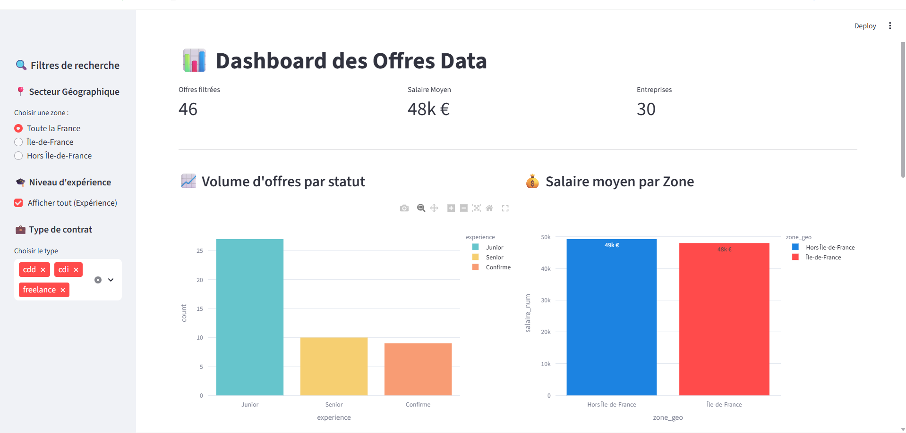
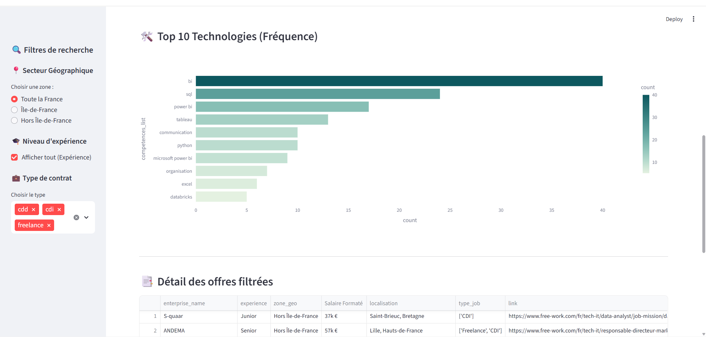

# Data Scraping and Analysis Project

## Overview
This project is designed to scrape data, clean it, and provide an interactive analysis interface using Streamlit. The workflow includes data extraction, cleaning, and visualization, making it easy to gain insights from raw data sources.

## Features
- Automated data scraping from specified source(FreeWork website)
- Data cleaning and preprocessing using pandas
- Export of cleaned data to CSV format
- Interactive data analysis and visualization with Streamlit

## Project Structure
- `main.py`: Main script for running the data scraping and cleaning pipeline.
- `streamlit.py`: Streamlit app for interactive data analysis and visualization.
- `data_cleaned.csv`: Output file containing the cleaned dataset.
- `credentials.py`: Stores credentials. In that project we don't need API KEY so in the file you'll just see the url of the website we used to make scraping
- `requirements.txt`: List of required Python packages.

## Installation
1. Clone the repository:
   ```bash
   git clone <repository_url>
   cd scraping_data_for_analysis
   ```
2. Install dependencies:
   ```bash
   pip install -r requirements.txt
   ```
3. Set up your credentials in `credentials.py` as needed.

## Usage
- To run the data scraping and cleaning process:
  ```bash
  python main.py
  ```
- To launch the Streamlit interface:
  ```bash
  streamlit run streamlit.py
  ```

## Streamlit Interface






## License
See the `LICENSE` file for details.

## Author
Arnel Fokou
